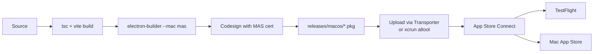

# Mac App Store build

For maintainers shipping Out Loud through the Mac App Store (MAS) or TestFlight. For regular local builds, see [`../app/architecture.md#development-commands`](../app/architecture.md#development-commands) and the [root README build guide](../../README.md#build-from-source).

## Contents

- [Prerequisites](#prerequisites)
- [Pipeline](#pipeline)
- [Commands](#commands)
- [Testing MAS builds](#testing-mas-builds)
- [Entitlements](#entitlements)
- [Troubleshooting](#troubleshooting)
- [See also](#see-also)

## Prerequisites

1. **Apple Developer Account** ($99/year)
2. **Certificates** from Apple Developer Portal:
   - _3rd Party Mac Developer Application_ — signs the app
   - _3rd Party Mac Developer Installer_ — signs the `.pkg`
3. **Provisioning profile** for bundle ID `com.outloud.app`

## Pipeline



## Commands

```bash
# Unsigned development build — for inspecting structure
npm run electron:build:mas-dev

# Production build — requires certificates
npm run electron:build:mas
```

## Testing MAS builds

### Unsigned development build

```bash
npm run electron:build:mas-dev
```

Won't launch due to sandbox requirements, but the app bundle in `releases/macos/` is inspectable.

### Signed development build

With certificates in Keychain:

```bash
npm run electron:build:mas
```

Signed `.pkg` lands in `releases/macos/`.

### TestFlight distribution

1. Build a signed MAS package
2. Upload to App Store Connect with Transporter or `xcrun altool`
3. Create a TestFlight build in App Store Connect
4. Invite testers

### Sandbox testing without full signing

```bash
npm run electron:build:mac
codesign --force --deep --sign - \
  "releases/macos/mac-arm64/Out Loud.app" \
  --entitlements build-resources/entitlements.mas.plist
```

## Entitlements

Defined in [`build-resources/entitlements.mas.plist`](../../build-resources/entitlements.mas.plist):

| Entitlement                                              | Purpose                                           |
| -------------------------------------------------------- | ------------------------------------------------- |
| `com.apple.security.app-sandbox`                         | Required for MAS                                  |
| `com.apple.security.network.client`                      | Outbound network (unused, kept for compatibility) |
| `com.apple.security.network.server`                      | Local HTTP API on port 51730                      |
| `com.apple.security.files.user-selected.read-write`      | Export audio files                                |
| `com.apple.security.files.downloads.read-write`          | Save to Downloads                                 |
| `com.apple.security.cs.allow-jit`                        | ONNX runtime                                      |
| `com.apple.security.cs.allow-unsigned-executable-memory` | ONNX runtime                                      |
| `com.apple.security.cs.disable-library-validation`       | Native dependencies                               |

> JIT and unsigned-memory entitlements may require an exception request from Apple for App Store approval.

## Troubleshooting

### "Code signature invalid"

- Native binaries (onnxruntime, ffmpeg) properly signed?
- Provisioning profile matches bundle ID?

### "App sandbox violation"

- Entitlements include all required permissions?
- File access stays inside sandbox-allowed paths?

### App Store rejection for JIT entitlements

Request an exception from Apple with justification for ONNX runtime.

## See also

- [`../app/architecture.md`](../app/architecture.md) — the code being packaged
- [`../../electron-builder.json`](../../electron-builder.json) — packaging configuration
- [`../extensions/testing.md`](../extensions/testing.md) — Safari App Store path reuses this pipeline
