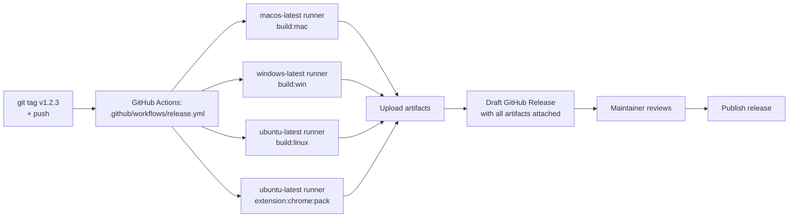

# Releasing

How to cut a new release. CI does the heavy lifting — you bump the version, tag it, push, and GitHub Actions builds + publishes a draft release.

## Contents

- [Output layout](#output-layout)
- [Release pipeline](#release-pipeline)
- [Cutting a release](#cutting-a-release)
- [Local builds (for verification)](#local-builds-for-verification)
- [Code signing](#code-signing)
- [Troubleshooting](#troubleshooting)
- [See also](#see-also)

## Output layout

All build artifacts land under `releases/` (gitignored):

```
releases/
├── macos/           *.dmg · *-mac.zip · *.blockmap
├── windows/         *-Setup.exe · *.blockmap
├── linux/           *.AppImage · *.deb · *.blockmap
└── extensions/
    ├── out-loud-chrome.zip
    └── safari/      Xcode project (generated from chrome-extension)
```

## Release pipeline



## Cutting a release

From a clean `main` branch:

```bash
# 1. Bump version (keeps package.json + creates git tag)
npm version patch   # or minor / major
# → commits "1.0.1" and tags it as "v1.0.1"

# 2. Push commit + tag together
git push --follow-tags

# 3. Watch the workflow
gh run watch
```

The tag push triggers [`.github/workflows/release.yml`](../../.github/workflows/release.yml), which:

1. Builds the macOS app on `macos-latest` (both `arm64` + `x64`)
2. Builds the Windows installer on `windows-latest`
3. Builds the Linux AppImage + .deb on `ubuntu-latest`
4. Packs the Chrome extension on `ubuntu-latest`
5. Creates a **draft** GitHub Release with all artifacts attached

Draft releases aren't public — review the assets and notes, then click **Publish release** in the GitHub UI when ready.

### Manual trigger

If you need to re-run a release build without re-tagging:

```bash
gh workflow run release.yml -f tag=v1.0.1
```

## Local builds (for verification)

You can run any build locally. Outputs land in `releases/<platform>/`.

```bash
npm run electron:build:mac       # macOS .dmg + .zip (arm64 + x64)
npm run electron:build:win       # Windows .exe (from Windows host)
npm run electron:build:linux     # Linux .AppImage + .deb
npm run extension:chrome:pack    # Chrome extension zip
npm run extension:safari:convert # Safari Xcode project (macOS + Xcode)
```

Cross-platform caveats:

- **From macOS** — you can build mac natively. Windows/Linux cross-builds work with electron-builder's bundled tooling but can't properly sign.
- **From Linux/Windows** — can't build macOS (notarization requires Apple hardware).
- **CI does each platform on its native runner**, so all builds are proper.

## Code signing

Release builds are **Developer-ID signed on macOS** (using the cert pinned in `electron-builder.json` as `mac.identity`) and **unsigned on Windows**. Notarization on macOS is currently disabled (`mac.notarize: false`) — flip it back on once Apple's notary service is reliable again.

### macOS first-launch UX

| Build state | What users see on first launch |
| ----------- | ------------------------------ |
| Developer-ID signed AND notarized (1.0.3+) | App opens immediately, no dialog. |
| Developer-ID signed, NOT notarized (1.0.2 only) | "macOS cannot verify the developer of Out Loud." Workaround is OS-version-dependent. |

1.0.2 shipped signed-but-not-notarized because Apple's notary service was stuck for 24+ hours during the release window. Their queue cleared later the same day; 1.0.3 flipped `mac.notarize` back to `true` and notarization succeeded.

If Apple's notary service stalls again in the future:
- Flip `mac.notarize: false` in `electron-builder.json` to ship signed-only.
- Document the per-OS workaround for that release.
- Flip back to `true` once Apple's queue is healthy and cut a patch.

End-user workaround instructions (right-click → Open on macOS 14, Privacy & Security → Open Anyway on macOS 15+) live in the [main README](../../README.md#macos-first-launch).

### macOS: enabling notarization

When ready (and when Apple's notary service is healthy), flip `mac.notarize` to `true` in `electron-builder.json` and ensure these env vars / GitHub secrets are set:

| Secret                        | Source                                                   |
| ----------------------------- | -------------------------------------------------------- |
| `CSC_LINK`                    | Base64-encoded `.p12` certificate (for CI)               |
| `CSC_KEY_PASSWORD`            | Password for the `.p12`                                  |
| `APPLE_ID`                    | Apple ID email                                           |
| `APPLE_APP_SPECIFIC_PASSWORD` | App-specific password from appleid.apple.com             |
| `APPLE_TEAM_ID`               | Apple Developer Team ID                                  |

For local builds on a Mac that has the cert in Keychain, you only need the three `APPLE_*` env vars (or `APPLE_KEYCHAIN_PROFILE` if you stored credentials via `xcrun notarytool store-credentials`).

For Mac App Store (not Developer ID direct distribution), see [`mac-app-store.md`](./mac-app-store.md).

### Windows

| Secret                  | Source                                  |
| ----------------------- | --------------------------------------- |
| `WIN_CSC_LINK`          | Base64-encoded `.pfx` certificate       |
| `WIN_CSC_KEY_PASSWORD`  | Password for the `.pfx`                 |

Without these, the Windows installer ships unsigned and SmartScreen prompts users to confirm on first run.

### Linux

No signing required for AppImage or .deb.

## Troubleshooting

### "No artifacts uploaded"

One of the platform builds failed. Check the workflow logs — the release job runs regardless so successful artifacts still attach.

### "Release already exists"

Either the tag was published previously, or a previous run already created it. Delete the existing draft in GitHub UI, or publish/delete it, then re-run.

### Local mac build fails with "requires macOS"

`electron:build:mac` must run on macOS. On other platforms, rely on CI.

### Linux build missing `.deb`

Ensure `dpkg` is available (it is on `ubuntu-latest`). Locally on macOS, `.AppImage` builds but `.deb` requires `dpkg` (install with `brew install dpkg`).

## See also

- [`../../README.md#build-from-source`](../../README.md#build-from-source) — local build commands
- [`../../electron-builder.json`](../../electron-builder.json) — packaging config
- [`mac-app-store.md`](./mac-app-store.md) — MAS-specific flow (different from direct distribution)
