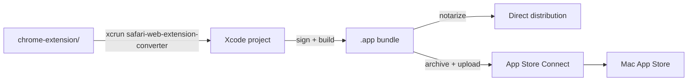

# Out Loud — Safari extension

Safari Web Extensions require a native macOS app container. This project uses the same codebase as the [Chrome extension](../chrome-extension/README.md) and wraps it via Apple's conversion tool.

## Contents

- [Prerequisites](#prerequisites)
- [Build pipeline](#build-pipeline)
- [Build](#build)
- [Distribution](#distribution)
- [Notes](#notes)
- [License](#license)

## Prerequisites

- Xcode 14+
- Apple Developer account (for distribution)
- macOS 12+

## Build pipeline



## Build

### 1. Convert the Chrome extension

```bash
xcrun safari-web-extension-converter ../chrome-extension \
  --project-location ./SafariExtension \
  --app-name "Out Loud Extension" \
  --bundle-identifier com.lightcloudlabs.outloud.extension
```

A shortcut is wired up in the root `package.json`:

```bash
npm run extension:safari:convert
```

### 2. Open in Xcode

```bash
open ./SafariExtension/Out\ Loud\ Extension.xcodeproj
```

### 3. Configure signing

- Select the project in Xcode
- **Signing & Capabilities** → pick your development team
- Enable **App Sandbox** if you plan to ship through the Mac App Store

### 4. Build & run

- Select **My Mac** as the destination
- `⌘R` to build and launch
- Safari will prompt to enable the extension

### 5. Enable in Safari

**Safari → Settings → Extensions → Out Loud**

## Distribution

### Direct distribution (notarized)

```bash
xcodebuild -scheme "Out Loud Extension" -configuration Release archive
# Then notarize with notarytool
```

### Mac App Store

Archive in Xcode and upload to App Store Connect. See [`../docs/build/mac-app-store.md`](../docs/build/mac-app-store.md) for signing, entitlements, and the full pipeline.

> The MAS build can't talk to the Out Loud HTTP server while sandboxed. Ship the standalone macOS app separately, or bundle the TTS engine inside the Safari app container.

## Notes

- The Safari extension shares code with the Chrome extension (port `51730`).
- Background script handles communication with the desktop app.
- Extension won't function without the desktop app running (or a bundled alternative).

## License

[MIT](../LICENSE)
